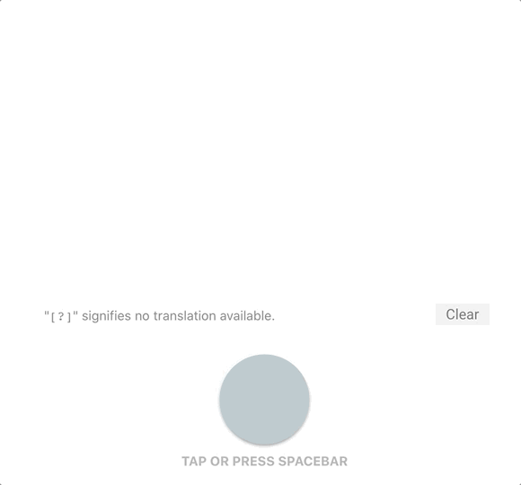

# Learn Morse Code

This web app helps beginners learn Morse code through several features, the main of which is a telegraph with live translation.
<table><tr><td>
    
</td></tr></table>

Watch the video demo [here](https://www.youtube.com/embed/OuL-Z8h4gBQ).

## Features
* **Telegraph**\
Press the button(s) to generate tones. See a live translation of your tones in both Morse code and alphanumeric characters. Customize the telegraph by choosing the telegraph type, tone frequency, and speed (WPM).

* **Practice Mode**\
Freely use the telegraph to practice Morse code while reading about it in the sidebar.

* **Challenge Mode**\
Take timed challenges to translate words into Morse code. Customize challenges by changing the word list category, word count, and word order.

* **Legend**\
See the Morse alphabet and other characters in the legend. Tap on a legend item to hear the Morse translation.

* **Morse Translator**\
Type in the translator below the legend and see/listen to the Morse translation.

## App Info
This web app was built using HTML, CSS, and ReactJS. It utilizes React hooks to manage state and component lifecycle.

See it live here: https://genemecija.github.io/learn-morse-code/
